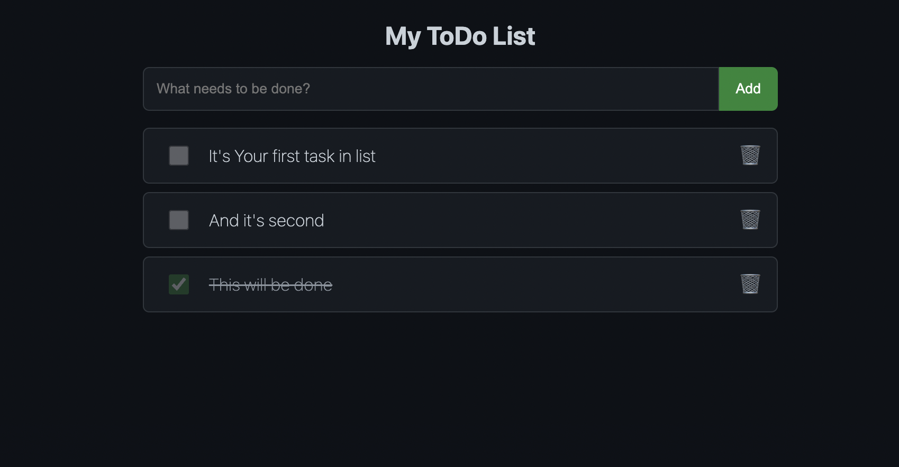

# 📝 JS_Simple_ToDo — Classic Todo Application in Pure JavaScript

> Minimalistic ToDo app built without any frameworks.  
> Implemented using modern OOP features, `#private` fields, and direct DOM manipulation.



## 🚀 Features

- ✅ Pure JavaScript (ES2022+)
- 📦 `ToDoList` class with private fields and methods
- 🧠 Business logic fully separated from UI (MVC-like approach)
- ⌨️ Add tasks by clicking "Add" or pressing Enter
- 🔁 Toggle task completion and remove tasks
- 🌓 Styled like GitHub's dark mode (mobile-friendly)

## 📁 Structure

- `index.html` — HTML layout
- `styles.css` — Dark theme, mobile-first design
- `ToDoApp.js` — Main logic with OOP

## 💻 How to Run

```bash
git clone https://github.com/Alexander-Lucens/JS_Simple_ToDo.git
cd JS_Simple_ToDo/ToDoApp
open index.html  # or just open in your browser